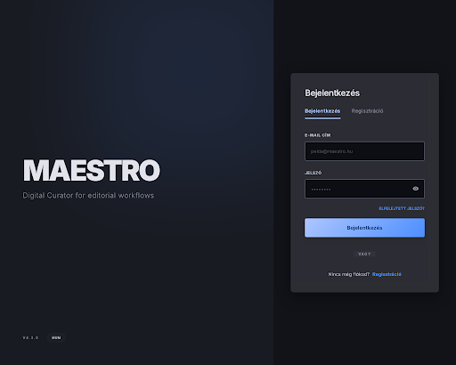

# Stitch screen — auth-flow

**Stitch screen**: `projects/6473627341647079144/screens/dd5eaf0b57124d3fbf74394ef9c0d036`
**Stitch title**: „Maestro - Auth Split View"
**Device**: Desktop (2560×2048)
**Generálva**: 2026-04-06 — Fázis 0

## Mit mutat

Teljes viewport split layout:

- **Bal 60%**: dark canvas nagy „MAESTRO" display tipográfiával, alatta tagline „Digital Curator for editorial workflows". Bal alsó sarokban `v4.1.0` verziós chip és `HUN` nyelvi chip.
- **Jobb 40%**: glassmorphism card (surface_container_highest + backdrop blur + ambient cloud shadow) függőlegesen középre igazítva. Tartalma:
  - H1 „Bejelentkezés"
  - Két tab: „Bejelentkezés" (aktív, 3px primary blue alsó blade) és „Regisztráció"
  - E-mail input („peldai@maestro.hu")
  - Jelszó input eye toggle-lel
  - Jobbra igazított link „Elfelejtett jelszó?"
  - Primary gradient gomb „Bejelentkezés"
  - Divider: „vagy"
  - Alsó rész: „Nincs még fiókod? Regisztráció" link

## Mely React komponensekbe fordul

Fázis 1-ben a Dashboard auth flow-hoz:

| React komponens | Hová kerül |
|----------------|-----------|
| `LoginView.jsx` (meglévő, bővítve) | `/login` route |
| `RegisterView.jsx` (új) | `/register` route — a tab UI alapja: ugyanaz a kártya, másik tab aktív |
| `AuthSplitLayout.jsx` (új) | A bal hero + jobb kártya split — wrapper az összes auth oldalhoz (`/login`, `/register`, `/forgot-password`, `/reset-password`, `/verify`, `/invite`, `/onboarding`) |
| `BrandHero.jsx` (új) | A bal oldali MAESTRO + tagline + verzió/nyelv chip blokk |

## Design tokenek (a Dashboard [styles.css](../../../packages/maestro-dashboard/css/styles.css)-ből)

- Card háttér: `surface_container_highest` @ 80% opacity + `backdrop-filter: blur(12px)`
- Card shadow: `box-shadow: 0 12px 40px rgba(0, 0, 0, 0.4)` (ambient cloud shadow)
- Gomb gradiens: `primary` → `primary_container`, 135°
- Aktív tab blade: 3px `primary` (#adc6ff)
- Input háttér: `surface_container_lowest`
- Tagline szín: `on_surface_variant`

## Manuális React munka

A Stitch HTML-ből NEM 1:1 fordítunk. A képi minta adja a layout és vizuális irányt, de:
- A form state management `react-hook-form` + Zod validációval (a Dashboard `LoginView` mintáján)
- A tab navigáció `react-router-dom` `<NavLink>` komponensekkel — az aktív tab nem kliens-state, hanem route alapú
- Az Appwrite SDK hívások: `account.createEmailPasswordSession()`, `account.create()` + `account.createVerification()`, stb.
- Az input maszk/validáció a meglévő `ValidatedTextField` mintájához igazodik
- A `BrandHero` responsive: kisebb viewport-on a hero összeszűkül, tablet-en a kártya alá kerül vertikális stack-ben

## Változatok

Az `AuthSplitLayout` ugyanazt a vázat használja a többi auth képernyőhöz — a jobb oldali kártya tartalma cserélődik:
- `/register` — név, e-mail, jelszó, jelszó megerősítés inputok
- `/verify` — mail ikon + „Ellenőrizd az e-mailedet" + „Új link küldése" gomb
- `/forgot-password` — egyetlen e-mail input + „Visszaállító link küldése" gomb
- `/reset-password` — új jelszó + megerősítés inputok
- `/onboarding` — 2 lépéses stepper (org név → office név)
- `/invite` — org neve, meghívó neve, „Elfogadom" gomb

Ezekhez további Stitch képek generálása **opcionális** — az auth-flow kártya patternje újrahasználható.
