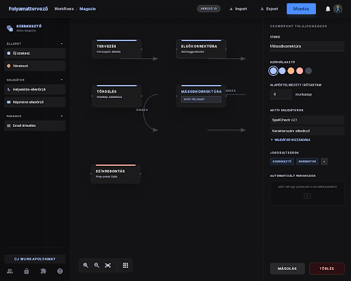

## Stitch screen — designer-canvas

**Stitch screen**: `projects/6473627341647079144/screens/05982df3413e4c04b52631ef2111e7ef`
**Stitch title**: „Magazin Folyamattervező"
**Device**: Desktop
**Generálva**: 2026-04-07 — Fázis 0 (variant B kiválasztva, variant A: `6da19f54b6e848dfac49bec99f3e9088`)

> A Stitch két variánst generált a promptra. A B variánst választottuk, mert teljesen lefedi a tervezett három-oszlopos layout-ot a properties sidebar tartalmával együtt; az A variáns tisztább esztétikai bázis, később referencia maradhat finomításhoz.

## Mit mutat — strukturális elemek

Csak azokat az elemeket sorolom fel, amelyeket a Fázis 5 React implementációnak biztosítania kell. A vizuális részletek (pontos színek, ikonok, tipográfia) inspirációként szolgálnak, nem 1:1 fordításhoz.

- **Háromoszlopos rács**: bal node palette / középső xyflow canvas / jobb properties sidebar.
- **Felső toolbar**: workflow név, verzió chip, Import / Export / Mentés gombok.
- **Bal palette szekciók**: kategória csoportok (Állapot, Validátor, Parancs) — drag source elemekkel a canvas számára.
- **Bal palette plusz tabok**: a designer mellék-paneljei (csoportok, UI elem permissionök, capability label-ek). Fázis 5 első iterációban legalább a placeholder szekciók helyét le kell foglalni — a tényleges szerkesztés jöhet később.
- **Canvas területen state node-ok**: címke, állapot leírás chip (pl. „aktív folyamat"), input/output portok, irányított edge-ek.
- **Canvas alsó sáv**: zoom kontrollok + minimap-szerű overview.
- **Jobb sidebar**: kiválasztott node tulajdonságainak szerkesztője (lásd `properties-sidebar.md`).
- **Bal alsó sarok primary CTA**: „Új munkapolyamat" — listanézethez vissza vagy új workflow indító.

## Mely React komponensekbe fordul (Fázis 5)

| React komponens | Hová kerül |
|----------------|-----------|
| `WorkflowDesignerPage.jsx` (új) | `/admin/office/:officeId/workflow` route |
| `DesignerToolbar.jsx` (új) | Felső sáv: workflow név, verzió, mentés/import/export gombok |
| `NodePalette.jsx` (új) | Bal oldali drag source panel — kategóriák szerint csoportosítva |
| `WorkflowCanvas.jsx` (új) | `@xyflow/react` `<ReactFlow>` wrapper — `compiled.states` → node-ok, `compiled.transitions` → edge-ek |
| `CanvasMinimap.jsx` (új) | xyflow `<MiniMap>` + `<Controls>` (zoom, fit view) |
| `PropertiesSidebar.jsx` (új) | Lásd `properties-sidebar.md` |
| `WorkflowSelectorButton.jsx` (új) | Bal alsó sarok primary action |

## Design tokenek

A Dashboard [styles.css](../../../packages/maestro-dashboard/css/styles.css) „Digital Curator" tokenjei:

- Panel háttér: `surface_container_low` + `backdrop-filter: blur(12px)` (no-line border)
- Panelek elválasztása: kontraszt + gap, NEM vonal
- Toolbar gomb: `surface_container_high` háttér, `on_surface` felirat, primary CTA: gradient gomb (`primary` → `primary_container`)
- Edge szín: `outline_variant` alap, kiválasztva `primary`
- Aktív palette tab: 3px `primary` blade

## Manuális React munka

A Stitch HTML/CSS-ből NEM 1:1 fordítunk. A kép a layout vázat adja, de:

- **xyflow integráció**: a canvas teljes egészében `@xyflow/react` — a Stitch HTML drag source-ai csak inspirációként szolgálnak. A node-ok custom node típusként implementálódnak (`StateNode.jsx` — lásd `state-node.md`).
- **Drag-and-drop a palette → canvas irányba**: HTML5 DnD vagy `@dnd-kit` — a Stitch SVG-ben nincs DnD logika.
- **State management**: a designer graph belső állapota (`graph` JSON) Zustand vagy React state. Mentéskor a `compiler.js` → `validator.js` → `databases.updateDocument(workflows)` lánc fut.
- **Hot-reload**: a workflow Realtime subscription frissíti a canvas-t más felhasználó mentésekor (Fázis 5 nice-to-have, kezdeti iterációban manuális refresh).
- **Undo/redo**: a Fázis 5 első iterációjában nincs — a tervfájl B.7 ezt rögzítette.

## Eltérés a tervtől, amit nem implementálunk

- A Stitch által rajzolt 5 állapot nem a Maestro 8 állapotú magazin workflow-ja — csak példaként szolgál.
- A toolbar gombok pontos szövege/sorrendje a végleges UI-ban változhat (a `Verzió 16` chip-et pl. csak a `compiled.version` kötése után kötjük be).
- A jobb sidebar pontos field layout-ja a `properties-sidebar.md` szerint változhat.
