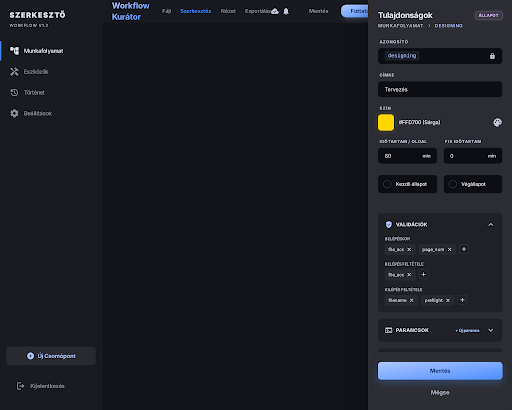

## Stitch screen — properties-sidebar

**Stitch screen**: `projects/6473627341647079144/screens/cf75bd0271b54838b47f26248a3af3ac`
**Stitch title**: „Workflow Properties Panel"
**Device**: Desktop
**Generálva**: 2026-04-07 — Fázis 0 (variant B kiválasztva, variant A: `b1e43374ed0f4db0b24f984a66774ba0`)

> A B variánst választottuk, mert minden mezőt feliratokkal és értékekkel ad vissza, és az adatkötés nyilvánvaló. Az A variáns vizuálisan kompaktabb, de olvashatatlanul kicsi — az ott látható elrendezés referenciaként megmarad a Stitch projektben.

## Mit mutat — strukturális elemek

A jobb oldali sidebar egy **kiválasztott state node tulajdonságait** szerkeszti. A sidebar tartalma dinamikusan változik a kijelölés szerint (state / transition / nincs kijelölés / csoport / element permission / capability) — ez a screen csak a state-szerkesztő nézetet mutatja. A többi nézethez nem készül külön Stitch kép.

### State szerkesztő mezők (a Stitch screen szerint, a tervhez igazítva)

- **Azonosító** (`state.id`) — slug chip, **read-only** lakat ikonnal (érték: `designing`). Csak akkor szerkeszthető, ha nincs hivatkozó cikk.
- **Címke** (`state.label`) — text input, kötelező (érték: `Tervezés`)
- **Szín** (`state.color`) — színkód kiírás + színes swatch + színpaletta picker (érték: `#FFD700 (Sárga)`)
- **Időtartam / oldal** (`state.duration.perPage`) — number input, perc egységgel (érték: `60 min`)
- **Fix időtartam** (`state.duration.fixed`) — number input, perc egységgel (érték: `0 min`)
- **Kezdőállapot** (`state.isInitial`) — kerek radio/toggle (a workflow-ban csak EGY állapot lehet kezdő — a UI-nak ezt érvényesítenie kell)
- **Végállapot** (`state.isTerminal`) — kerek radio/toggle (több is lehet)
- **Validációk collapsible szekció** (alapból nyitva)
  - `Belépéskor` (`state.validations.onEntry`) — multi-select chipek + `+` add gomb
  - `Belépés feltétele` (`state.validations.requiredToEnter`) — multi-select chipek
  - `Kilépés feltétele` (`state.validations.requiredToExit`) — multi-select chipek
- **Parancsok collapsible szekció** (alapból csukva)
  - `+ Új parancs` action — dropdown a command ID-ból + `allowedGroups` multi-select
- **Mentés / Mégse** sticky alsó gombsor

### Hiányzó mező a Stitch képről, amit Fázis 5-ben pótolni kell

A terv (`UI_DESIGN.md` §4) tartalmazta a következőket, amik a screen-en NEM jelennek meg, de a `compiled.states[].statePermissions` séma miatt szükségesek:

- **State permissions** collapsible szekció — csoport slug-ok multi-select. Ki melyik csoport tagjai mozgathatják ki a cikket ebből az állapotból.

A React komponensben ezt is megjelenítjük; a Stitch image NEM a teljes specifikáció.

## Mely React komponensekbe fordul (Fázis 5)

| React komponens | Hová kerül |
|----------------|-----------|
| `PropertiesSidebar.jsx` (új) | A jobb oldali panel root — kijelölés alapján rendereli a megfelelő szerkesztőt |
| `StatePropertiesEditor.jsx` (új) | A state node szerkesztője (ez a screen) |
| `TransitionPropertiesEditor.jsx` (új) | Transition kiválasztva — label, allowedGroups |
| `WorkflowPropertiesEditor.jsx` (új) | Semmi sincs kiválasztva — workflow level info (verzió, név, last update) |
| `ValidationListField.jsx` (új helper) | A három validáció mező (`onEntry`, `requiredToEnter`, `requiredToExit`) közös multi-select chip listája |
| `CommandListField.jsx` (új helper) | Parancsok kollapsible — `+ Új parancs` + lista |
| `GroupMultiSelectField.jsx` (új helper) | Csoport slug multi-select (state permissions, command allowedGroups, transition allowedGroups) — ugyanaz a komponens |
| `ColorPickerField.jsx` (új helper) | Szín swatch + paletta + hex input |

## Design tokenek

- Sidebar háttér: `surface_container_low` + `backdrop-filter: blur(12px)`
- Input háttér: `surface_container_lowest`, `outline_variant` 1px border (no-line elv: csak hover/focus-kor látszik)
- Collapsible header: `surface_container_high`, expand chevron `on_surface_variant`
- Chip háttér: `secondary_container`, szín `on_secondary_container`
- Mentés gomb: primary gradient (`primary` → `primary_container`)
- Mégse gomb: text only, `on_surface_variant`
- Sticky alsó sáv: `surface_container_low` + felül 1px `outline_variant` divider — kivételesen vonal, hogy a scroll alatt is elválasztott legyen

## Manuális React munka

- **Form state**: `react-hook-form` + Zod validációval. A Zod séma a `compiled.states[]` séma részhalmaza — egy közös schema definíció a `WorkflowDesignerPage`-en.
- **Adatkötés a graph state-hez**: a designer belső `graph` state-jét egy hook (`useDesignerSelection`) közvetíti, amely a kijelölés alapján adja át a megfelelő subset-et a sidebar-nak. Mentés gomb → a `graph[selectedNodeId]` frissül.
- **Validátor lista forrása**: a `compiled.validators` enumból (workflow-szintű, lokális validátor regisztráció) jönnek a választható chipek.
- **Csoport lista forrása**: a Fázis 2-ben létrejövő `groups` collection a háttérben tölti fel a választható csoport slug-okat. Fázis 5-ben (mire ide érünk) ez már elérhető lesz.
- **Color picker**: nincs kész SWC komponens — egyszerű HTML `<input type="color">` + hex input mező kombinációja.
- **„Mégse" viselkedés**: az utolsó mentett értékre visszaállítja a sidebar form-ot — NEM dobja el az egész graph szerkesztést.

## Eltérés a tervtől, amit nem implementálunk

- A Stitch screen `Másodkorrektúra` cím + más demo értékeket mutat — ez csak példa, a valós értékek a kijelölt state-ből jönnek.
- A „Másolás" / „Törlés" gombok az alsó toolbar-on nem szerepelnek a tervben — Fázis 5-ben a node törlés Delete billentyűvel és context menüvel történik (az xyflow `onNodesDelete` callbackjén keresztül), a duplikálás Cmd+D kombinációval. A Stitch által rajzolt két gomb opcionális, és a Fázis 5 első iterációban kihagyható.
- Az autocomplete javaslatok („Új autocomplete parancs") csak Stitch placeholder szöveg — nem implementáljuk.
