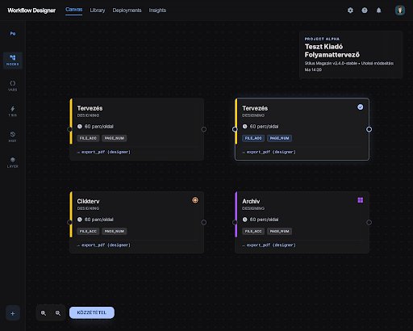

## Stitch screen — state-node

**Stitch screen**: `projects/6473627341647079144/screens/c45123d03e12456fb6f4856019c14f34`
**Stitch title**: „Workflow Node Variants Grid"
**Device**: Desktop
**Generálva**: 2026-04-07 — Fázis 0 (variant A kiválasztva, variant B: `d663ea3f92be4fe39a49d7fde9095d1a`)

> A két variáns közül az A pontosan a kért 2×2 grid-et adja vissza (default / selected / initial / terminal). A B variáns egyetlen részletesebb node-ot mutat collapsible szekciókkal — referenciaként megmarad a Stitch projektben, később a `properties-sidebar`-ral közös vizuális nyelv finomításához.

## Mit mutat — strukturális elemek

A node anatómia mind a négy variánsban azonos, csak a státusz jelzések különböznek:

- **Színes accent bar a node tetején** — a workflow `state.color` mező megjelenítése
- **Cím (label)** — a `state.label` mező (pl. „Tervezés", „Cikkterv", „Archív")
- **Állapot ID alatta kis betűvel** — slug megjelenítés (pl. „designing")
- **Időtartam sor** — `60 perc/oldal` (a `state.duration.perPage` és `state.duration.fixed` vizualizálva)
- **Validátor badge sor** — kompakt chipek (`FILE_ACC`, `PAGE_NUM`) a `state.validations.requiredToEnter` és `requiredToExit` rövidítéseiből
- **Parancs preview sor** — `→ export_pdf (designer)` az első parancs elem előnézete a `state.commands` tömbből
- **Bal input port + jobb output port** — xyflow `<Handle>` kötési pontok

**A négy variáns megkülönböztetése:**

| Variáns | Vizuális jel | DB alap |
|---------|--------------|---------|
| `default` | Sima kártya, surface_container_high háttér | (alapeset) |
| `selected` | Primary blue glow border + emelt shadow | xyflow `selected` state |
| `initial` | Bal felső sarokban körkörös ⊕ ikon, narancssárga accent | `state.isInitial = true` |
| `terminal` | Jobb felső sarokban négyzet ikon, lila accent | `state.isTerminal = true` |

A jobb felső sarokban további info kártya is látszik (project név, workflow verzió) — ez nem része a node-nak, hanem a canvas info overlay-é, a `designer-canvas.md`-hez tartozik.

## Mely React komponensekbe fordul (Fázis 5)

| React komponens | Hová kerül |
|----------------|-----------|
| `StateNode.jsx` (új) | Custom xyflow node típus — `nodeTypes={{ state: StateNode }}` regisztrációval |
| `StateNodeAccent.jsx` (új helper) | A felső accent bar — `state.color` background-color |
| `StateNodeBadgeRow.jsx` (új helper) | Validátor + parancs chipek tömör listája — overflow esetén `+N` chip |
| `StateNodeStatusIcon.jsx` (új helper) | Initial / terminal jelző ikon a node sarkában |

A négy variáns NEM külön komponens — egyetlen `StateNode.jsx` rendereli mindet `props` alapján:
- `data.color`, `data.label`, `data.id`, `data.duration`, `data.validations`, `data.commands`, `data.isInitial`, `data.isTerminal`
- `selected` az xyflow saját prop-ja (a `<Handle>` mellé érkezik)

## Design tokenek

- Node háttér: `surface_container_high`, no-line border
- Selected glow: `box-shadow: 0 0 0 2px primary, 0 8px 24px rgba(adc6ff, 0.3)`
- Accent bar magasság: 4px, top border-radius
- Validator chip: `surface_container_highest` háttér, `on_surface_variant` szín
- Initial ikon szín: `tertiary` (narancs), terminal ikon szín: `primary_container` (lila)
- Port szín: `outline` alap, `primary` kijelölve

## Manuális React munka

- Az xyflow `<Handle>` komponensek nem jelennek meg a Stitch HTML-ben — manuálisan kell hozzáadni `type="target"` (bal) és `type="source"` (jobb) konfigurációval.
- A „60 perc/oldal" stringet a `formatDuration(state.duration)` helper számolja a `perPage` és `fixed` mezőkből — a Stitch nem tud erről.
- A badge-ek overflow kezelése (ha sok validátor van): max 3 chip + `+N more` chip, hover-re tooltip a teljes listával.
- A node mérete fix (pl. 240×160 px) — az xyflow `nodeOrigin` és `defaultViewport` ehhez igazodik. A Stitch HTML mérete eltérő lehet.

## Eltérés a tervtől, amit nem implementálunk

- A Stitch project kontextus kártya (jobb felül „PROJECT ALPHA / Teszt Kiadó / Stílus Magazin v2.4.0") a `WorkflowDesignerPage` header-ébe kerül, NEM a node-ba.
- A bal sidebar (rövidítések „NODES, VARS, RUN, EDIT, LAYER") a Stitch saját demo eleme — a Maestro designernek a `designer-canvas.png` szerinti palette-je van, NEM ez.
- Az alsó „KÖZZÉTÉTEL" gomb a Stitch demo része — a publikálás flow-t a workflow `commands` mezője kezeli, nem külön gomb.
