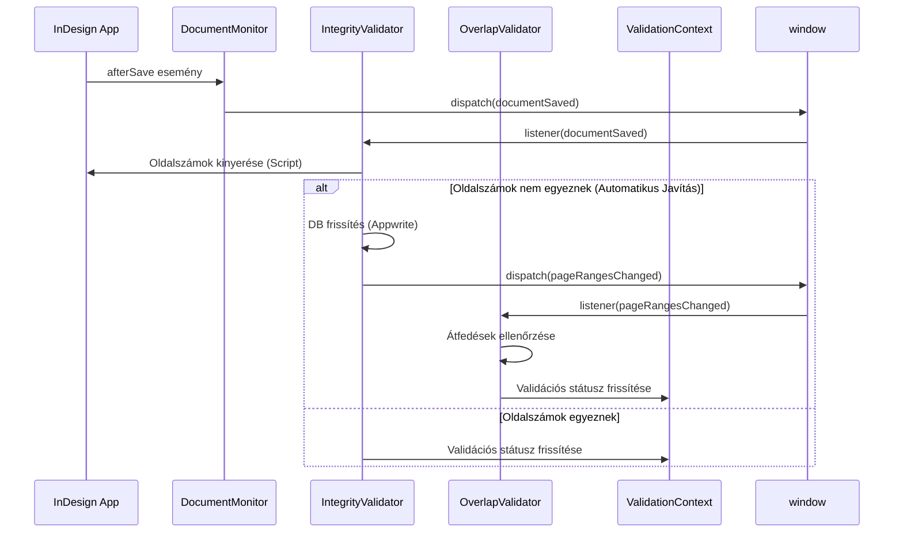
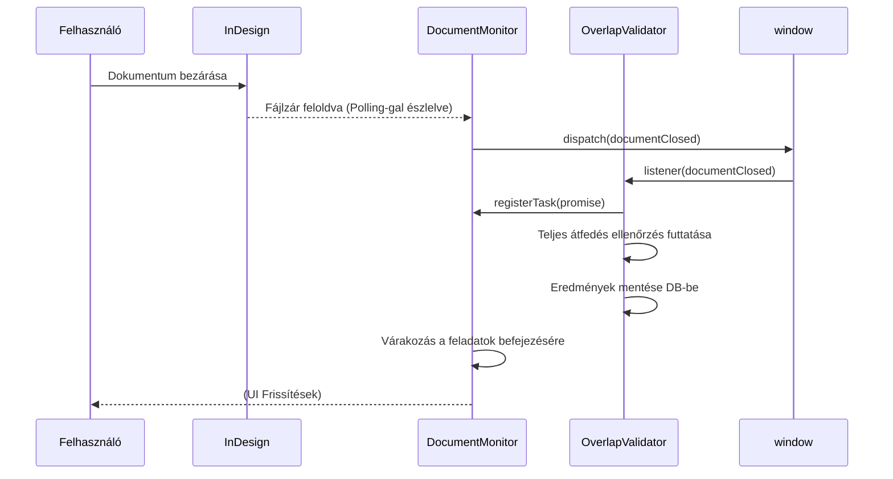
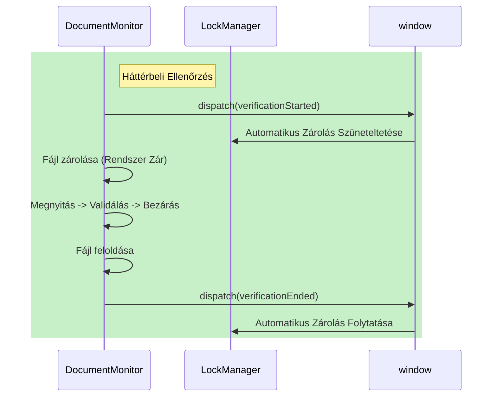

# Maestro Esemény Architektúra

Ez a dokumentum a Maestro Plugin belső, eseményvezérelt architektúráját írja le. A rendszer egyedi eseménybuszt használ (DOM `CustomEvent` alapon) a komponensek szétcsatolására, az InDesign életciklus kezelésére és a validációs logika koordinálására.

## Alapkoncepció
A plugin **„Pub/Sub"** (Közzétevő/Feliratkozó) modellben működik, szabványos DOM eseményekkel a `window` objektumon.
*   Az **események** megtörtént tényeket képviselnek (múlt idő, pl. `documentSaved`).
*   A **payload**-ok (`detail`) kontextust hordoznak (pl. az érintett `article` objektumot).
*   A **feliratkozók** reagálnak ezekre a tényekre (pl. validátorok futtatják az ellenőrzéseiket).

### Központi Konfiguráció
Minden esemény konstans és a dispatch helper az alábbi fájlban van definiálva:
`src/core/config/maestroEvents.js`

## Esemény Katalógus

### 1. Dokumentum Életciklus Események
Ezek az események az aktív InDesign dokumentum állapotát követik.

| Esemény Neve            | Konstans         | Közzétevő         | Payload (`detail`)                    | Leírás                                                                                                                                      |
| :---------------------- | :--------------- | :----------------- | :------------------------------------ | :------------------------------------------------------------------------------------------------------------------------------------------ |
| **Dokumentum Mentve**   | `documentSaved`  | `DocumentMonitor`  | `{ article, filePath }`               | Az InDesign szabványos `afterSave` eseménye után tüzel. Integritás ellenőrzéseket indít.                                                     |
| **Dokumentum Bezárva**  | `documentClosed` | `DocumentMonitor`  | `{ article, filePath, registerTask }` | Akkor tüzel, amikor a rendszer észleli, hogy a dokumentum fájlzárja feloldódott (bezárva). Támogatja az **Aszinkron Koordinációt** a `registerTask`-on keresztül. |

#### A `registerTask` Minta
A `documentClosed` esemény egyedi abban, hogy támogatja az aszinkron koordinációt. A figyelők regisztrálhatnak egy Promise-t, hogy késleltessék az eseményciklus befejezését (pl. hasznos a „Ellenőrzés..." UI állapot aktívan tartásához).

```javascript
// Figyelő példa
window.addEventListener(MaestroEvent.documentClosed, (event) => {
    const { registerTask } = event.detail;
    const validationPromise = runValidationAsync();
    registerTask(validationPromise);
});
```

### 2. Validációs & Adat Események
Ezek az események adatváltozásokat jeleznek, amelyek újravalidálást vagy UI frissítést igényelnek.

| Esemény Neve                | Konstans                     | Közzétevő                                         | Payload                           | Leírás                                                                                            |
| :-------------------------- | :--------------------------- | :------------------------------------------------- | :-------------------------------- | :------------------------------------------------------------------------------------------------ |
| **Oldalszámok Változtak**   | `pageRangesChanged`          | `DatabaseIntegrityValidator`, `ArticleProperties`  | `{ article }`                     | Oldalszám változáskor tüzel (automatikus javítás vagy újraszámozás). Átfedés validációt indít.     |
| **Layout Változott**        | `layoutChanged`              | `ArticleProperties`, `useLayouts`                  | `{ article }` vagy `{ articles, publicationId }` | Layout változáskor (egyedi) vagy layout törléskor (tömeges) tüzel. Átfedés validációt indít.      |
| **Lefedettség Változott**   | `publicationCoverageChanged` | `Workspace`                                        | `{ publication }`                 | A kiadvány oldalkorlátainak változásakor tüzel. A kiadvány összes cikkére validációt indít.        |
| **Cikkek Hozzáadva**        | `articlesAdded`              | `Publication`                                      | `{ publicationId }`              | Új cikkek hozzáadása után tüzel. Átfedés/struktúra validációt indít (PublicationStructureValidator). |
| **Állapot Változott**       | `stateChanged`               | `WorkflowEngine`                                   | `{ article, oldState, newState }` | Sikeres workflow átmenet után tüzel.                                                               |

### 3. Infrastruktúra & Koordináció
Rendszer-szintű események a session kezeléshez és komponens zároláshoz.

| Esemény Neve               | Konstans               | Közzétevő                       | Payload     | Leírás                                                                     |
| :------------------------- | :--------------------- | :------------------------------- | :---------- | :------------------------------------------------------------------------- |
| **Panel Megjelent**        | `panelShown`           | `PanelController`                | `undefined` | A plugin panel láthatóvá válásakor tüzel (alkalmazás aktiválás, sleep/wake). |
| **Session Lejárt**         | `sessionExpired`       | `DataContext`                    | `undefined` | 401-es Auth hiba esetén tüzel. Bejelentkezési felszólítást/kijelentkezést indít. |
| **Adatfrissítés**          | `dataRefreshRequested` | `RealtimeClient`, `DataContext`  | `undefined` | Globális adat lekérést kér (pl. újracsatlakozás után).                      |
| **Zár Ellenőrzés**         | `lockCheckRequested`   | Különböző                        | `undefined` | Kényszeríti a `LockManager`-t a zárak szinkronizálására (pl. programozott megnyitás után). |
| **Ellenőrzés Indult**      | `verificationStarted`  | `DocumentMonitor`                | `undefined` | Jelzi a `LockManager`-nek, hogy SZÜNETELTESSE a felhasználói zárolást (Maestro dolgozik). |
| **Ellenőrzés Befejeződött** | `verificationEnded`    | `DocumentMonitor`                | `undefined` | Jelzi a `LockManager`-nek, hogy FOLYTASSA a felhasználói zárolást.          |

## Eseményfolyamatok (Szekvencia Diagramok)

### 1. A Validációs Hurok
Hogyan indítja el egy mentés akció a validációs láncot.



### 2. Dokumentum Bezárás & Átfedés Ellenőrzés
Hogyan indít a dokumentum bezárás cikkek közötti kereszt-validációt.



### 3. Zárolás Koordináció
Versenyhelyzetek megelőzése, amikor a Maestro háttérben ellenőriz egy fájlt.



## Legjobb Gyakorlatok
1.  **Laza Csatolás**: A komponensek lehetőleg ne importálják egymást; használj eseményeket.
2.  **Aszinkron Biztonság**: Ha a figyelőd aszinkron munkát végez, amelyre a küldőnek várnia kell, keresd a `registerTask` lehetőséget az esemény részletei között (a `documentClosed`-ben használt minta).
3.  **Idempotencia & Takarítás**: A figyelőknek kecsesen kell kezelniük a duplikált eseményeket. **Mindig adj vissza cleanup függvényt** a `useEffect` hook-okban az eseményekről való leiratkozáshoz, megelőzve a figyelők exponenciális duplikálódását újra-rendereléskor.
4.  **Hibakezelés**: A figyelőknek el kell kapniuk a saját hibáikat, hogy ne blokkolják a többi feliratkozót.
