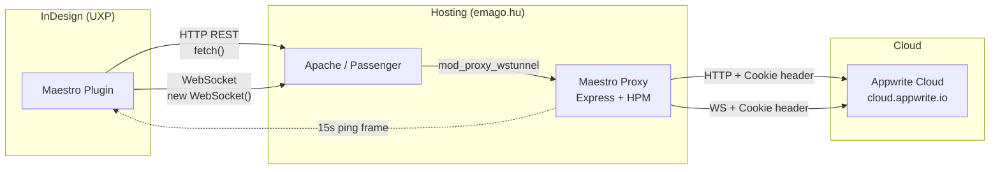

# Proxy Server (Maestro Proxy)

## Áttekintés

A Maestro Proxy egy Express-alapú reverse proxy szerver, amely az Appwrite Cloud elé ültetett közvetítő réteg. Feladata:

1. **Auth Injection** — Az UXP WebSocket limitációk megkerülése (query params → HTTP headers)
2. **WebSocket Keep-Alive** — Periodikus ping frame-ek az idle timeout megelőzésére
3. **CORS kezelés** — Az InDesign UXP kliens cross-origin kéréseinek engedélyezése

A szerver a hosting szolgáltató (cPanel/Passenger) környezetében fut, és az `emago.hu/maestro-proxy/` útvonalon érhető el.

## Architektúra



## Fő komponensek

### Auth Injection (`injectAuthenticationFromQueryParams`)

Az UXP WebSocket API nem támogat custom headereket a handshake során. Megoldás:

1. A kliens (`realtimeClient.js`) query paraméterként küldi az auth adatokat:
   - `x-fallback-cookies` — Appwrite session cookie (JSON objektum)
   - `x-appwrite-package-name` — Platform azonosító
2. A proxy `onProxyReq` (HTTP) és `onProxyReqWs` (WS upgrade) hookjai ezeket szabványos HTTP headerekké alakítják:
   - `Cookie: a_session_<projectId>=<token>`
   - `X-Appwrite-Package-Name: <packageName>`

```
Kliens URL:  wss://emago.hu/v1/realtime?...&x-fallback-cookies={"a_session_xyz":"token123"}
Proxy →:     Cookie: a_session_xyz=token123
             X-Appwrite-Package-Name: com.sashalmiimre.maestro
```

### WebSocket Keep-Alive (Ping)

Az Apache/Passenger idle timeout (~60s) megszakítja a tétlen WebSocket kapcsolatokat. A proxy 15 másodpercenként WebSocket ping frame-eket (`0x89 0x00`) küld az aktív klienseknek.

- A `server.on('upgrade')` eseménnyel nyomon követi az aktív socket-eket (`activeSockets` Set)
- A `setInterval` periodikusan ping-el
- A socket `close`/`error` eseményekor automatikusan eltávolítja a Set-ből

### Log szűrés (`proxyLogger`)

A kliens bontásakor (sleep, panel-hide, recovery reconnect) keletkező `EPIPE` és `ECONNRESET` hibák normális jelenségek — a proxy custom loggerrel szűri ki ezeket a `http-proxy-middleware` belső naplóiból. Valódi hibák (pl. `ETIMEDOUT` — Appwrite nem elérhető) továbbra is megjelennek.

### Graceful Shutdown

`SIGTERM`/`SIGINT` jelzésre a szerver:
1. Lezárja az aktív WebSocket kapcsolatokat
2. Befejezi a futó HTTP kéréseket (max 10s)
3. Tisztán kilép

## Konfiguráció

| Beállítás | Érték | Leírás |
|-----------|-------|--------|
| `PORT` | `3000` (env) | Express szerver port |
| `target` | `https://cloud.appwrite.io` | Appwrite Cloud endpoint |
| `keepAliveTimeout` | `65000` ms | TCP keep-alive (> Apache 60s default) |
| `headersTimeout` | `66000` ms | HTTP headers timeout (keepAlive + 1s) |
| `WS_PING_INTERVAL` | `15000` ms | WebSocket ping gyakoriság |
| HTTP `proxyTimeout` | `60000` ms | HTTP proxy kérés timeout |
| WS `proxyTimeout` | `0` (nincs) | WebSocket nincs timeout (hosszú életű) |

### Hosting előfeltételek

| Követelmény | Leírás |
|-------------|--------|
| Node.js 18+ | A szerver futtatókörnyezete |
| `mod_proxy_wstunnel` | Apache modul a WebSocket upgrade továbbításához |
| Passenger | Node.js alkalmazás menedzsment (cPanel) |

## Útvonalak

| Útvonal | Típus | Cél |
|---------|-------|-----|
| `/v1/health`, `/maestro-proxy/v1/health` | GET | Health check (nem proxy-zott) |
| `/v1/realtime`, `/maestro-proxy/v1/realtime` | WS | Appwrite Realtime WebSocket |
| `/v1/*`, `/maestro-proxy/v1/*` | HTTP | Appwrite REST API |

A dupla útvonalak (`/v1/` és `/maestro-proxy/v1/`) azért kellenek, mert a Passenger alkalmazás a `/maestro-proxy/` alatt fut, de a belső routing már levágja a prefixet — mindkét variánst kezelni kell.

## Hibakezelés

### Hibajelentések a logban

| Hiba | Jelentés | Kezelés |
|------|----------|---------|
| `EPIPE` | Kliens bontotta a kapcsolatot, proxy még írni próbált | **Normális** — szűrve, nem jelenik meg |
| `ECONNRESET` | Kapcsolat váratlanul megszakadt | **Normális** — szűrve |
| `ETIMEDOUT` | Appwrite Cloud nem válaszolt időben | **Valódi hiba** — megjelenik a logban |
| `[HTTP Proxy Error]` | HTTP kérés proxy hiba | 502-es választ küld a kliensnek |
| `[WS Proxy Error]` | WebSocket proxy hiba | Socket megsemmisítése |
| `[Auth Inject Error]` | Cookie/header injection sikertelen | Logolva, kérés továbbmegy header nélkül |

### Troubleshooting

1. **WebSocket nem csatlakozik (1006)**
   - Ellenőrizd, hogy az `mod_proxy_wstunnel` Apache modul engedélyezve van
   - Keresd a `[WS Proxy Error]` üzeneteket a logban

2. **Ismétlődő ETIMEDOUT**
   - Ellenőrizd az [Appwrite Status](https://status.appwrite.online/) oldalt
   - A `keepAliveAgent` max socket limitje (`maxSockets: 100`) elég-e a terheléshez?

3. **Session lejárat (401)**
   - A kliens `clearLocalSession()` → újra bejelentkezés → új cookie → a proxy automatikusan az újat injektálja

## Függőségek

```json
{
    "express": "^4.x",
    "http-proxy-middleware": "^2.x || ^3.x",
    "cors": "^2.x"
}
```

A `proxyLogger` konfiguráció mindkét HPM verzióval kompatibilis (`logLevel`/`logProvider` v2-höz, `logger` v3-hoz).

## Kapcsolódó dokumentáció

- [REALTIME_ARCHITECTURE.md](REALTIME_ARCHITECTURE.md) — WebSocket auth bridge részletek, kliens oldali implementáció
- [diagrams/network-architecture.md](diagrams/network-architecture.md) — Hálózati kapcsolatkezelés, sleep recovery
