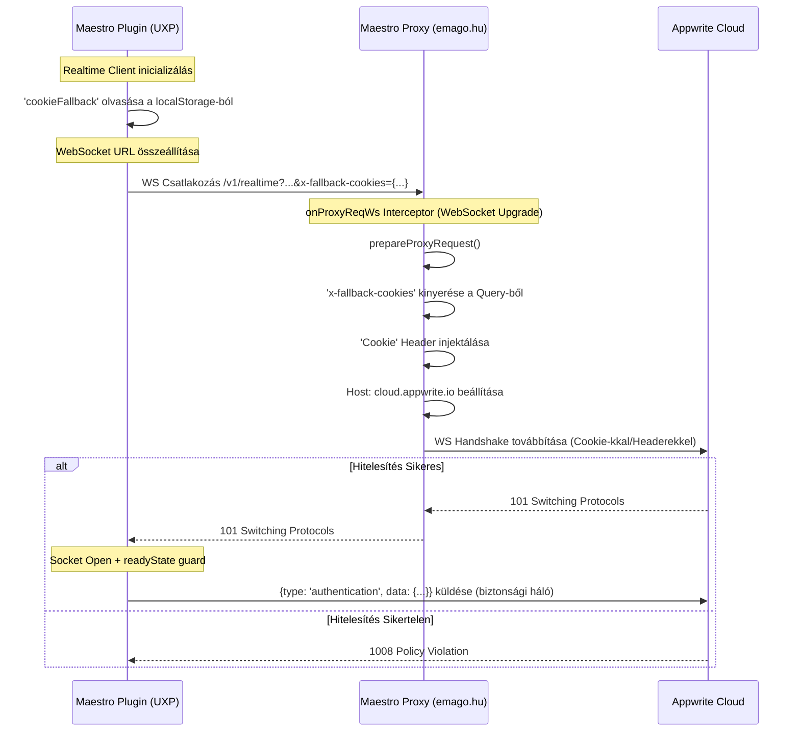

# Realtime Architektúra & Hitelesítési Bridge

## Áttekintés
Ez a dokumentum leírja az architektúrális megoldást, amellyel az Appwrite Realtime kapcsolatokat engedélyezzük az Adobe UXP környezetben a Maestro plugin számára.

A UXP platform limitációi miatt a szabványos WebSocket kapcsolatok nem hitelesíthetők hagyományos módszerekkel (Cookie-k vagy Custom Headerek). Ezért egy **Proxy-alapú Hitelesítési Bridge**-et implementáltunk a probléma megoldására.

## A Probléma: UXP WebSocket Limitációk
Az Adobe UXP hálózati stack-je a WebSocket-ekhez szigorú korlátozásokkal rendelkezik:
1.  **Nincs Cookie Hozzáférés**: A WebSocket-ek nem osztják meg automatikusan a `Cookie` tárolót a `fetch` kérésekkel.
2.  **Nincsenek Custom Headerek**: A UXP WebSocket API nem támogatja custom headerek (mint `Cookie`, `X-Appwrite-Project`, vagy `X-Appwrite-Package-Name`) küldését a kezdeti handshake során.

Ennek eredményeként a közvetlen Appwrite Realtime kapcsolat `1008 Policy Violation` hibával sikertelen, mert a szerver hitelesítetlen kérést kap.

## A Megoldás: Proxy Auth Injection
A probléma megoldásához a meglévő CORS Proxy-nkat (`proxy/server.js`) használjuk hitelesítési bridge-ként. A kliens az auth adatokat URL Query Paraméterekként küldi, és a Proxy ezeket szabványos HTTP Headerekké alakítja, mielőtt továbbítaná a kérést az Appwrite felé.

### Architektúra Diagram

### Implementációs Részletek

#### 1. Kliens-oldal (`src/core/config/realtimeClient.js`)
Felülírjuk a szabványos Appwrite SDK `createSocket` metódusát és **Singleton Mintát** implementálunk:
*   **Globális Singleton**: Az aktív példányt a `window.__maestroRealtimeInstance`-ban tárolja. Modul újratöltéskor (hot-reload) lekapcsolja az előző példányt a duplikált kapcsolatok megelőzésére.
*   **Kapcsolat-deduplikáció**: A `createSocket` szigorúan ellenőrzi, hogy van-e már `CONNECTING` vagy `OPEN` állapotú socket, mielőtt újat hozna létre.
*   A session cookie-t a `localStorage`-ból olvassa (`cookieFallback`).
*   Hozzáfűzi a WebSocket URL-hez query paraméterként: `?x-fallback-cookies=...`.
*   Hozzáfűzi a csomag nevet: `?x-appwrite-package-name=...`.
*   **Biztonsági háló**: azonnali `authentication` frame küldése a kapcsolat megnyitása után (Appwrite natív funkció).
*   **UXP readyState guard**: `socket.readyState === WebSocket.OPEN` ellenőrzés + 200ms retry védi a UXP WebSocket timing problémáktól, ahol az `open` esemény hamarabb tüzel, mint hogy a socket kész lenne a `send()`-re.

#### 2. Proxy-oldal (`server.js`)
Az auth injection logika egy közös `injectAuthenticationFromQueryParams()` függvénybe van kiszervezve, amelyet a `prepareProxyRequest()` hív mindkét hook-ból:
*   **`onProxyReq`**: HTTP kéréseknél fut (REST API hívások).
*   **`onProxyReqWs`**: WebSocket upgrade kéréseknél fut — **ez kritikus**, mert az `onProxyReq` NEM tüzel WS upgrade-eknél!

Mindkét hook:
*   Elemzi a kérés URL-jét.
*   Kinyeri az `x-fallback-cookies` és `x-appwrite-package-name` paramétereket a query-ből.
*   **Injektálja** őket szabványos `Cookie` és `X-Appwrite-Package-Name` headerekként.
*   Beállítja a `Host` headert (`cloud.appwrite.io`) a `changeOrigin` mellett.

A proxy emellett biztosítja:
*   **WebSocket ping** (15s) — periodikus ping frame-ek az Apache/Passenger idle timeout megelőzésére.
*   **EPIPE/ECONNRESET szűrés** — a kliens lecsatlakozásakor keletkező normális hibák el vannak nyomva a logokból.
*   **Graceful shutdown** — SIGTERM/SIGINT jelzésre a nyitott socket-ek bezáródnak a tiszta kilépés előtt.

> Részletes proxy dokumentáció: [PROXY_SERVER.md](PROXY_SERVER.md)

## Konfiguráció

| Komponens             | Beállítás           | Érték                               |
| :-------------------- | :------------------ | :---------------------------------- |
| **Appwrite Platform** | Hostname            | `emago.hu`                          |
| **Plugin Konfig**     | `endpointManager.getEndpoint()` | Railway (primary) / emago.hu (fallback) |
| **Proxy Szerver**     | `Host` Header       | `cloud.appwrite.io` (`changeOrigin: true`) |

## Szerverhiba Ellenállóképesség

Az Appwrite szerver időnként alkalmazásszintű hibákat küldhet (pl. `{type: "error", code: 1003}`). A `realtimeClient.js` az alábbi mechanizmusokkal kezeli ezeket:

### Exponenciális Backoff
Szerverhiba után az újracsatlakozási várakozási idő növekszik:
- 1. hiba: **5s** → 2.: **10s** → 3.: **20s** → 4.: **40s** → max **60s**

### Cooldown Mechanizmus
**5 egymás utáni** szerverhiba esetén:
1. Egy **60 másodperces cooldown** aktiválódik — ebben az időszakban nincs újracsatlakozási kísérlet
2. A `_notifyError()` értesíti a hiba-figyelőket
3. A cooldown lejárta után a számláló nullázódik és az újracsatlakozás folytatódik

### Számláló Nullázás
A `consecutiveServerErrors` számláló **nullára áll**:
- Amikor sikeres `event` típusú üzenet érkezik
- Amikor a `reconnect()` (Kényszerített Újracsatlakozás) meghívásra kerül

## API Ellenállóképesség

A Realtime kapcsolaton túl a Maestro plugin központosított védelmet alkalmaz minden kritikus adatbázis- és API-műveletre (pl. validációs eredmények mentése):

### Központosított Retry (`withRetry`)
A `promiseUtils.js`-ben definiált `withRetry` helper:
- **Exponenciális backoff**: 1s → 2s → 4s (max 3 kísérlet).
- **Szelektív retry**: Csak átmeneti szerverhibáknál (502, 503, 504) és hálózati hibáknál próbálkozik újra.
- **Azonnali hiba**: Üzleti logikai hibák (pl. 401, 403, 404, 409) azonnal dobódnak retry nélkül.

## Sleep & Focus Detektálás Ellenállóképessége

Az InDesign környezet sajátossága, hogy az `IdleTask` szünetelhet aktív munka közben (dokumentum műveletek, mentés, preflight). A sleep detektor ezért az alábbi logikát használja:

1. **Küszöbérték (60s)**: Csak akkor tekinti alvásnak a kimaradást, ha több mint 60 másodperce nem érkezett idle tick (korábban 20s volt, ami hamis riasztásokat okozott aktív munka közben).
2. **Kapcsolat ellenőrzés**: Újracsatlakozás előtt kiértékeli a `realtime.getConnectionStatus()`-t.
   - Ha a kapcsolat **él**, nem bontja le (elkerülve a felesleges `FORCE RECONNECT`-et); csak egy `dataRefreshRequested` eseményt küld a REST API adatok frissítéséhez.
   - Ha a kapcsolat **megszakadt**, teljes kliens újraépítést végez.

## Hibakeresés

### Realtime lecsatlakozások (Hiba 1006 / 1008)
1.  **Proxy Logok**: Keresd a `[WS Proxy Error]` és `[HTTP Proxy Error]` üzeneteket — az EPIPE/ECONNRESET zajt a proxy automatikusan szűri.
2.  **Shared Hosting Limit**: Ha a proxy cPanel-en fut, ellenőrizd, hogy az Apache `mod_proxy_wstunnel` modul engedélyezve van, különben a WebSocket upgrade sikertelen lesz (1006).
3.  **Host egyezés**: A proxy `changeOrigin: true` + explicit `Host: cloud.appwrite.io` headert használ.

### Ismétlődő Szerverhiba (Code 1003)
1. **Appwrite Státusz**: Ellenőrizd az [Appwrite Status](https://status.appwrite.online/) oldalt.
2. **Console log**: Keresd a `[Realtime] Server Error (X/5)` üzeneteket — ha a számláló eléri az 5-öt, a cooldown aktiválódik.
