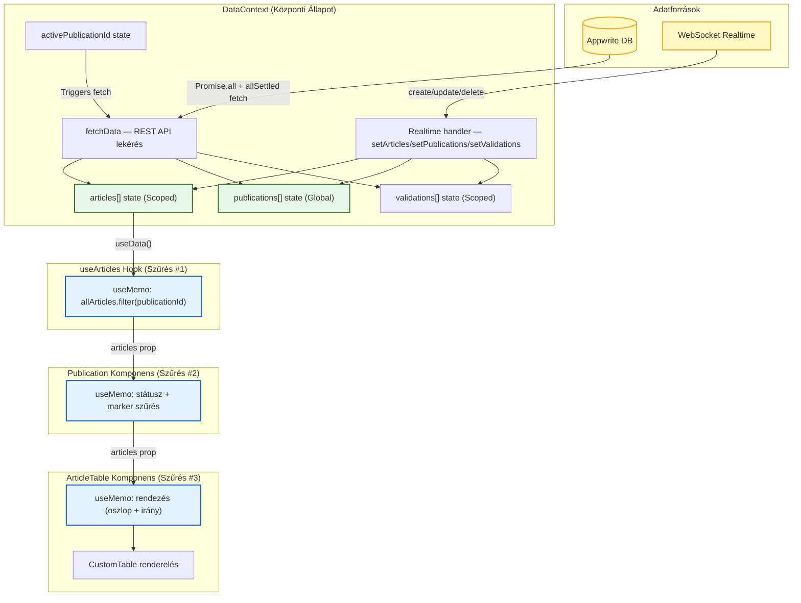
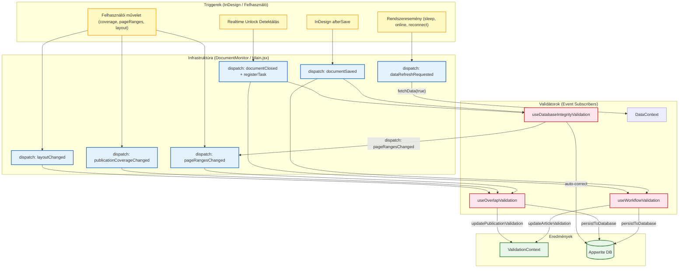

# Adatáramlási Architektúra

Ez a dokumentum bemutatja a Maestro plugin teljes adatáramlási rendszerét: hogyan jutnak el az adatok a szervertől a UI komponensekig, és milyen mechanizmusok tartják szinkronban az állapotot.

## Két adatáramlási mechanizmus

Az architektúrában két különálló mechanizmus működik párhuzamosan:

| Mechanizmus                                        | Cél                                            | Példa                                         |
| -------------------------------------------------- | ---------------------------------------------- | --------------------------------------------- |
| **React Context** (DataContext, ValidationContext) | "Mi az aktuális állapot?" — passzív adatfolyam | publications[], articles[], validations[], validationResults |
| **MaestroEvent rendszer** (window események)       | "Mi történt éppen?" — aktív jelzés             | documentSaved, pageRangesChanged              |

### Miért kettő?

- **Context = állapot**: A komponensek olvassák, a React renderelés automatikusan frissíti a UI-t.
- **Event = esemény**: Tranziens infót hordoz (pl. `registerTask` callback), amit nem lenne értelme state-be tenni. Laza csatolást biztosít — a kiváltó nem tudja (és nem is kell tudnia), ki reagál rá.

---

## 1. React Context alapú adatfolyam

### DataContext → ArticleTable renderelési lánc



### A három szűrő lépés

| #   | Hol            | Fájl:sor                   | Mit csinál                           | Trigger                                                   |
| --- | -------------- | -------------------------- | ------------------------------------ | --------------------------------------------------------- |
| 1   | `useArticles`  | `useArticles.js:60-63`     | `allArticles` → publicationId szűrés | `allArticles` vagy `publicationId` változás               |
| 2   | `Publication`  | `Publication.jsx:124-142`  | articles → státusz + marker szűrés   | `articles`, `statusFilters` vagy `markerFilters` változás |
| 3   | `ArticleTable` | `ArticleTable.jsx:150-198` | articles → rendezés (oszlop + irány) | `articles`, `sortColumn` vagy `sortDirection` változás    |

---

## 2. MaestroEvent alapú adatfolyam



### Esemény → Feliratkozó mátrix

| Esemény                      | useWorkflowValidation  | useDatabaseIntegrityValidation | useOverlapValidation |   DataContext   |
| ---------------------------- | :---------------------: | :----------------------------: | :------------------: | :-------------: |
| `documentSaved`              |   ha PREFLIGHT state    |              igen              |          —           |        —        |
| `documentClosed`             |   ha PREFLIGHT state    |      igen (registerTask)       |          —           |        —        |
| `stateChanged`               | belépés/kilépés kezelés |               —                |          —           |        —        |
| `pageRangesChanged`          |            —            |               —                |         igen         |        —        |
| `layoutChanged`              |            —            |               —                |         igen         |        —        |
| `publicationCoverageChanged` |            —            |               —                |         igen         |        —        |
| `dataRefreshRequested`       |            —            |               —                |          —           | fetchData(true) |

---

## 3. Komponens hierarchia

```text
Main.jsx
  └─ DataProvider (publications[], articles[])
       └─ ValidationProvider (validationResults Map)
            └─ Workspace
                 ├─ PublicationList
                 │    ├─ useOverlapValidation()          ← event subscriber
                 │    ├─ useDatabaseIntegrityValidation() ← event subscriber
                 │    ├─ DocumentMonitor                  ← event dispatcher (afterSave, unlock; kétfázisú detektálás)
                 │    ├─ LockManager                      ← lock kezelés (DB → realtime → UI)
                 │    └─ Publication (×N)
                 │         └─ useArticles(pubId)          ← DataContext szűrés
                 │              └─ ArticleTable
                 │                   └─ useValidation()   ← ValidationContext olvasás
                 │                        └─ CustomTable
                 │
                 └─ PropertiesPanel (ha kiválasztva)
                      └─ selectedArticle: useMemo a DataContext articles-ból
```

### Melyik komponens honnan kapja az adatot?

| Komponens         | Adatforrás               | Mechanizmus                                  |
| ----------------- | ------------------------ | -------------------------------------------- |
| `Publication`     | articles (szűrt)         | `useArticles()` → `useData()` → DataContext  |
| `ArticleTable`    | articles (szűrt + szűrt) | props a Publication-től                      |
| `ArticleTable`    | validationResults        | `useValidation()` → ValidationContext        |
| `Workspace`       | selectedArticle          | `useMemo` → DataContext articles[].find()    |
| `DocumentMonitor` | articles (összes)        | `useData()` → DataContext (ref-en keresztül) |

---

## 4. Write-Through Adatfolyam

A DataContext központi write-through API-t biztosít: a komponensek a DataContext metódusain
keresztül írnak (createArticle, updateArticle, stb.), ami DB írás UTÁN azonnal frissíti
a helyi state-et a szerver válaszával (optimistic update). A Realtime esemény is megérkezik,
de a `$updatedAt` staleness guard kiszűri az elavult eventeket.

```text
Felhasználó akció (Hook / Komponens)
  │
  └─→ DataContext write-through metódus (pl. updateArticle)
       │
       ├─→ 1. Appwrite DB write (tables.updateRow)
       │        → szerver válasz (friss dokumentum)
       │
       ├─→ 2. Optimistic: setArticles() a szerver válaszával → UI AZONNAL frissül
       │
       └─→ 3. Realtime WebSocket event (később megérkezik)
              └─→ DataContext realtime handler
                    └─→ $updatedAt guard: ha helyi adat frissebb → KIHAGYÁS
```

### applyArticleUpdate — Külső írók számára

A `WorkflowEngine` (executeTransition, lockDocument, unlockDocument, toggleMarker)
közvetlenül ír az adatbázisba. Ezek hívói az `applyArticleUpdate(serverDocument)` metódussal
frissítik a helyi state-et DB hívás nélkül — a szerver válaszát közvetlenül alkalmazzák.

```text
WorkflowEngine hívó (pl. DocumentMonitor, ArticleProperties)
  │
  ├─→ 1. WorkflowEngine.lockDocument() → DB write → szerver válasz
  │
  └─→ 2. applyArticleUpdate(serverDocument) → setArticles() → UI frissül
```

### $updatedAt Staleness Guard

Az `app.doScript()` (InDesign ExtendScript) blokkolja a JS szálat, és a WebSocket
események felgyűlnek. Amikor a blokkolás feloldódik, az elavult Realtime események
felülírhatnák az optimistic update-eket. A guard megakadályozza ezt:

```js
if (article.$updatedAt && payload.$updatedAt && article.$updatedAt > payload.$updatedAt) {
    return article; // Helyi adat frissebb, Realtime event kihagyva
}
```

### Lock/unlock — egységes realtime flow

A `WorkflowEngine.lockDocument()` és `unlockDocument()` sima `updateRow` hívásokat használnak
(tranzakció nélkül), amelyek megbízhatóan triggerelnek Appwrite realtime eventeket.
A valódi fájlszintű zárolást az InDesign `.idlk` mechanizmusa végzi — a DB lock informatív
jellegű (a UI-ban mutatja, ki szerkeszti éppen a fájlt).

```text
LockManager lock/unlock
  │
  └─→ WorkflowEngine.lockDocument() / unlockDocument()
       │
       └─→ tables.updateRow()  (sima DB update, nincs tranzakció)
            │
            └─→ Appwrite Realtime event
                 └─→ DataContext setArticles() → React renderel
```

Ez ugyanaz az adatfolyam, amit az `executeTransition` (állapotváltás) és a `toggleMarker` is követ.

---

## Megjegyzések

- **`window` eseményküldés**: UXP-ben biztonságos, minden plugin saját izolált `window`-ot kap. Alkalmazás-szintű eventekhez szemantikailag helyesebb, mint a `document`.
- **`articlesRef` pattern**: A validation hookok `useRef`-ben tartják a friss articles referenciát, hogy az event handler-ek (amelyek egyszer iratkoznak fel) mindig a legfrissebb adatot lássák.
- **Fetch generáció-számláló**: A `fetchGenerationRef` minden `fetchData` híváskor nő. Az eredmény feldolgozása előtt ellenőrzi, hogy a generáció még aktuális-e — ha közben újabb `fetchData` indult (pl. recovery + publication switch egyszerre), az elavult eredmény eldobódik. Ez megakadályozza a dupla fetch miatti state felülírást és UI ugrást.
- **Kritikus vs. nem-kritikus adatlekérés**: A publications és articles `Promise.all`-lal futnak (hiba → catch kezeli). A layouts és deadlines `Promise.allSettled`-del futnak — ha VPN-en timeout-olnak, a UI azonnal megjelenik a kritikus adatokkal, és toast figyelmeztet a hiányzó adatokról.
- **`registerTask` minta**: A `documentClosed` event-ben a `registerTask(promise)` callback lehetővé teszi, hogy a DocumentMonitor megvárja az összes validátor feladatát, mielőtt feloldaná a system lock-ot.
- **Kétfázisú unlock detektálás** (DocumentMonitor): A `previousLocksRef` MINDIG frissül (verifikáció alatt is), az unlock-ok pending queue-ba kerülnek. A feldolgozás csak ha NEM fut verifikáció. A `verificationEndTick` state biztosítja, hogy a verifikáció végén a pending unlock-ok is feldolgozódnak.
- **Friss article az event dispatch-ben**: A `documentClosed` event a `latestArticlesRef`-ből veszi a legfrissebb article adatot (nem a stale unlock-kori snapshotot), hogy a validátorok naprakész állapottal dolgozzanak.
