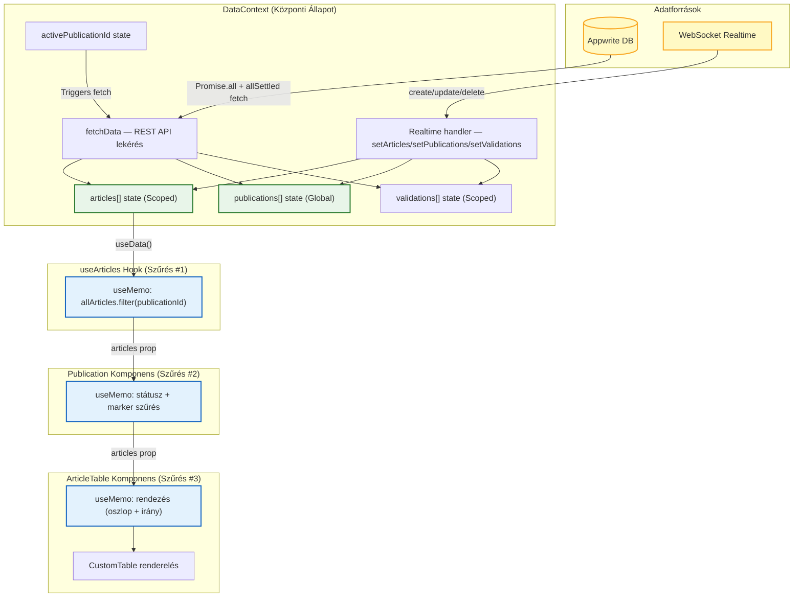
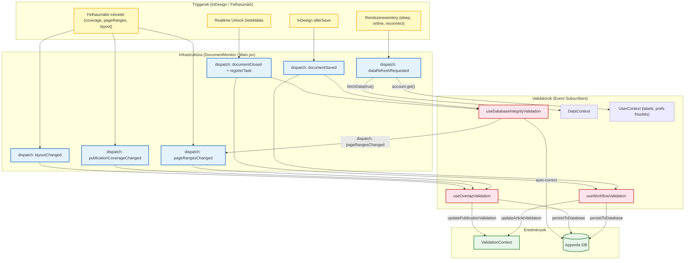
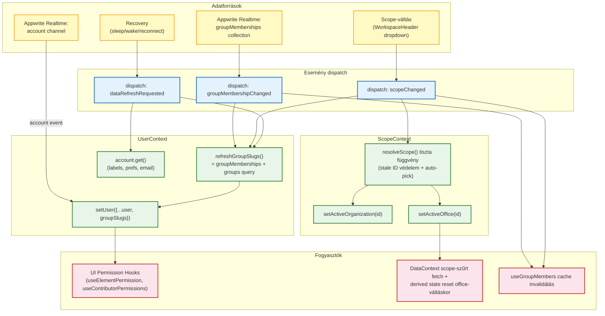

# Adatáramlási Architektúra

Ez a dokumentum bemutatja a Maestro plugin teljes adatáramlási rendszerét: hogyan jutnak el az adatok a szervertől a UI komponensekig, és milyen mechanizmusok tartják szinkronban az állapotot.

## Két adatáramlási mechanizmus

Az architektúrában két különálló mechanizmus működik párhuzamosan:

| Mechanizmus                                        | Cél                                            | Példa                                         |
| -------------------------------------------------- | ---------------------------------------------- | --------------------------------------------- |
| **React Context** (DataContext, ValidationContext) | "Mi az aktuális állapot?" — passzív adatfolyam | publications[], articles[], validations[], validationResults |
| **MaestroEvent rendszer** (window események)       | "Mi történt éppen?" — aktív jelzés             | documentSaved, pageRangesChanged              |

### Miért kettő?

- **Context = állapot**: A komponensek olvassák, a React renderelés automatikusan frissíti a UI-t.
- **Event = esemény**: Tranziens infót hordoz (pl. `registerTask` callback), amit nem lenne értelme state-be tenni. Laza csatolást biztosít — a kiváltó nem tudja (és nem is kell tudnia), ki reagál rá.

---

## 1. React Context alapú adatfolyam

### DataContext → ArticleTable renderelési lánc


```mermaid
graph TD
    subgraph "Adatforrások"
        AppwriteDB[(Appwrite DB)]
        AppwriteRT[WebSocket Realtime]
    end

    subgraph "DataContext (Központi Állapot)"
        FetchData[fetchData — REST API lekérés]
        RealtimeHandler[Realtime handler — setArticles/setPublications/setValidations]
        ActivePubId["activePublicationId state"]
        ArticlesState["articles[] state (Scoped)"]
        PubsState["publications[] state (Global)"]
        ValidationsState["validations[] state (Scoped)"]

        AppwriteDB -->|"Promise.all + allSettled fetch"| FetchData
        AppwriteRT -->|"create/update/delete"| RealtimeHandler
        ActivePubId -->|"Triggers fetch"| FetchData
        FetchData --> ArticlesState
        FetchData --> PubsState
        FetchData --> ValidationsState
        RealtimeHandler --> ArticlesState
        RealtimeHandler --> PubsState
        RealtimeHandler --> ValidationsState
    end

    subgraph "useArticles Hook (Szűrés #1)"
        FilterByPub["useMemo: allArticles.filter(publicationId)"]
        ArticlesState -->|"useData()"| FilterByPub
    end

    subgraph "Publication Komponens (Szűrés #2)"
        FilterByStatus["useMemo: státusz + marker szűrés"]
        FilterByPub -->|"articles prop"| FilterByStatus
    end

    subgraph "ArticleTable Komponens (Szűrés #3)"
        SortArticles["useMemo: rendezés (oszlop + irány)"]
        FilterByStatus -->|"articles prop"| SortArticles
        SortArticles --> CustomTable["CustomTable renderelés"]
    end

    classDef state fill:#e8f5e9,stroke:#2e7d32,stroke-width:2px;
    classDef filter fill:#e3f2fd,stroke:#1565c0,stroke-width:2px;
    classDef source fill:#fff9c4,stroke:#f9a825,stroke-width:2px;

    class ArticlesState,PubsState state;
    class FilterByPub,FilterByStatus,SortArticles filter;
    class AppwriteDB,AppwriteRT source;
```

### A három szűrő lépés

| #   | Hol            | Fájl:sor                   | Mit csinál                           | Trigger                                                   |
| --- | -------------- | -------------------------- | ------------------------------------ | --------------------------------------------------------- |
| 1   | `useArticles`  | `useArticles.js:60-63`     | `allArticles` → publicationId szűrés | `allArticles` vagy `publicationId` változás               |
| 2   | `Publication`  | `Publication.jsx:124-142`  | articles → státusz + marker szűrés   | `articles`, `statusFilters` vagy `markerFilters` változás |
| 3   | `ArticleTable` | `ArticleTable.jsx:150-198` | articles → rendezés (oszlop + irány) | `articles`, `sortColumn` vagy `sortDirection` változás    |

---

## 2. MaestroEvent alapú adatfolyam


```mermaid
graph TD
    subgraph "Triggerek (InDesign / Felhasználó)"
        AfterSave["InDesign afterSave"]
        UnlockDetect["Realtime Unlock Detektálás"]
        UserAction["Felhasználói művelet (coverage, pageRanges, layout)"]
        SystemEvent["Rendszeresemény (sleep, online, reconnect)"]
    end

    subgraph "Infrastruktúra (DocumentMonitor / Main.jsx)"
        DocSaved["dispatch: documentSaved"]
        DocClosed["dispatch: documentClosed + registerTask"]
        CoverageChanged["dispatch: publicationCoverageChanged"]
        PageRangesChanged["dispatch: pageRangesChanged"]
        LayoutChanged["dispatch: layoutChanged"]
        DataRefresh["dispatch: dataRefreshRequested"]

        AfterSave --> DocSaved
        UnlockDetect --> DocClosed
        UserAction --> CoverageChanged
        UserAction --> PageRangesChanged
        UserAction --> LayoutChanged
        SystemEvent --> DataRefresh
    end

    subgraph "Validátorok (Event Subscribers)"
        Preflight["useWorkflowValidation"]
        DBIntegrity["useDatabaseIntegrityValidation"]
        Overlap["useOverlapValidation"]

        DocSaved --> Preflight
        DocSaved --> DBIntegrity
        DocClosed --> Preflight
        DocClosed --> DBIntegrity
        PageRangesChanged --> Overlap
        CoverageChanged --> Overlap
        LayoutChanged --> Overlap
        DataRefresh -->|"fetchData(true)"| DataCtx["DataContext"]
        DataRefresh -->|"account.get()"| UserCtx["UserContext (labels, prefs frissítés)"]
    end

    subgraph "Eredmények"
        ValCtx["ValidationContext"]
        AppwriteDB2[(Appwrite DB)]

        Preflight -->|"updateArticleValidation"| ValCtx
        Preflight -->|"persistToDatabase"| AppwriteDB2
        Overlap -->|"updatePublicationValidation"| ValCtx
        Overlap -->|"persistToDatabase"| AppwriteDB2
        DBIntegrity -->|"auto-correct"| AppwriteDB2
        DBIntegrity -->|"dispatch: pageRangesChanged"| PageRangesChanged
    end

    classDef trigger fill:#fff9c4,stroke:#f9a825,stroke-width:2px;
    classDef infra fill:#e3f2fd,stroke:#1565c0,stroke-width:2px;
    classDef validator fill:#fce4ec,stroke:#c62828,stroke-width:2px;
    classDef result fill:#e8f5e9,stroke:#2e7d32,stroke-width:2px;

    class AfterSave,UnlockDetect,UserAction,SystemEvent trigger;
    class DocSaved,DocClosed,CoverageChanged,PageRangesChanged,LayoutChanged,DataRefresh infra;
    class Preflight,DBIntegrity,Overlap validator;
    class ValCtx,AppwriteDB2 result;
```

### Esemény → Feliratkozó mátrix

| Esemény                      | useWorkflowValidation   | useDatabaseIntegrityValidation | useOverlapValidation |   DataContext   |   UserContext   |
| ---------------------------- | :---------------------: | :----------------------------: | :------------------: | :-------------: | :-------------: |
| `documentSaved`              |   ha PREFLIGHT state    |              igen              |          —           |        —        |        —        |
| `documentClosed`             |   ha PREFLIGHT state    |      igen (registerTask)       |          —           |        —        |        —        |
| `stateChanged`               | belépés/kilépés kezelés |               —                |          —           |        —        |        —        |
| `pageRangesChanged`          |            —            |               —                |         igen         |        —        |        —        |
| `layoutChanged`              |            —            |               —                |         igen         |        —        |        —        |
| `publicationCoverageChanged` |            —            |               —                |         igen         |        —        |        —        |
| `articlesAdded`              |            —            |               —                | igen (merge + recalc)|        —        |        —        |
| `groupMembershipChanged`     |            —            |               —                |          —           |        —        | refreshGroupSlugs() |
| `scopeChanged`               |            —            |               —                |          —           | derived state reset | refreshGroupSlugs() |
| `workflowChanged`            |            —            |               —                |          —           | setWorkflow (hot-reload) |        —        |
| `dataRefreshRequested`       |            —            |               —                |          —           | fetchData(true) | account.get() + refreshGroupSlugs() |

---

## 2a. Multi-tenant scope + groupSlugs szinkronizáció

A Plugin multi-tenant (szervezet + szerkesztőség) hatókörrel dolgozik. A `ScopeContext` és a `UserContext` három csatornán keresztül tart szinkront:


```mermaid
graph TD
    subgraph "Adatforrások"
        GroupMembershipsRT["Appwrite Realtime:<br/>groupMemberships collection"]
        AccountRT["Appwrite Realtime:<br/>account channel"]
        ScopeChange["Scope-váltás<br/>(WorkspaceHeader dropdown)"]
        Recovery["Recovery<br/>(sleep/wake/reconnect)"]
    end

    subgraph "Esemény dispatch"
        GMC["dispatch: groupMembershipChanged"]
        SC["dispatch: scopeChanged"]
        DRR["dispatch: dataRefreshRequested"]

        GroupMembershipsRT --> GMC
        ScopeChange --> SC
        Recovery --> DRR
    end

    subgraph "UserContext"
        RefreshSlugs["refreshGroupSlugs()<br/>= groupMemberships + groups query"]
        AccountGet["account.get()<br/>(labels, prefs, email)"]
        SetUser["setUser({...user, groupSlugs})"]

        GMC --> RefreshSlugs
        SC --> RefreshSlugs
        DRR --> AccountGet
        DRR --> RefreshSlugs
        AccountRT -->|"account event"| SetUser
        RefreshSlugs --> SetUser
    end

    subgraph "ScopeContext"
        ResolveScope["resolveScope() tiszta függvény<br/>(stale ID védelem + auto-pick)"]
        SetOrg["setActiveOrganization(id)"]
        SetOffice["setActiveOffice(id)"]

        SC --> ResolveScope
        ResolveScope --> SetOrg
        ResolveScope --> SetOffice
    end

    subgraph "Fogyasztók"
        UIPermissions["UI Permission Hooks<br/>(useElementPermission, useContributorPermissions)"]
        DataCtxScope["DataContext scope-szűrt fetch +<br/>derived state reset office-váltáskor"]
        GroupMembersCache["useGroupMembers cache invalidálás"]

        SetUser --> UIPermissions
        SetOffice --> DataCtxScope
        GMC --> GroupMembersCache
        SC --> GroupMembersCache
    end

    classDef source fill:#fff9c4,stroke:#f9a825,stroke-width:2px;
    classDef event fill:#e3f2fd,stroke:#1565c0,stroke-width:2px;
    classDef ctx fill:#e8f5e9,stroke:#2e7d32,stroke-width:2px;
    classDef consumer fill:#fce4ec,stroke:#c62828,stroke-width:2px;

    class GroupMembershipsRT,AccountRT,ScopeChange,Recovery source;
    class GMC,SC,DRR event;
    class RefreshSlugs,AccountGet,SetUser,ResolveScope,SetOrg,SetOffice ctx;
    class UIPermissions,DataCtxScope,GroupMembersCache consumer;
```

### Kulcs garanciák

- **`sameGroupSlugs()` helper**: Set-alapú összehasonlítás — azonos tartalom esetén nem okoz re-rendert.
- **Stale ID védelem**: `ScopeContext` auto-pick effect csak `!membershipsError` esetén fut (átmeneti hiba nem törli a helyes scope-ot).
- **Scope-szűrt fetch**: `DataContext.fetchData` minden collection-hez hozzáfűzi a `Query.equal("editorialOfficeId", ...)` feltételt + `publications` esetén `isActivated === true` szűrést.
- **Office-váltáskor**: külön effect nullázza az `activePublicationId`-t és a derived state-et (`articles`, `layouts`, `deadlines`, `validations`).
- **ValidationContext reset**: `scopeChanged` eseményre a `sourceResults` Map teljesen törlődik (idegen office articleId-s eredmények kitisztítása).

---

## 3. Komponens hierarchia

```text
index.jsx
  └─ UserProvider                     ← Auth, session, groupSlugs szinkron (Realtime + recovery)
       └─ ConnectionProvider          ← Online/offline/connecting UI állapot
            └─ Main.jsx               ← Sleep detektálás, RecoveryManager trigger, Realtime watchdog
                 └─ ToastProvider     ← Toast értesítési rendszer
                      └─ (user?) ScopeProvider  ← activeOrganizationId, activeEditorialOfficeId (multi-tenant)
                           └─ DataProvider       ← publications[], articles[], validations[], workflows[]
                                └─ ValidationProvider ← validationResults Map (rendszer-validációk)
                                     └─ ScopedWorkspace  ← ScopeMissingPlaceholder / Workspace switch
                                          └─ Workspace
                                               ├─ PublicationList
                                               │    ├─ useOverlapValidation()          ← event subscriber
                                               │    ├─ useDatabaseIntegrityValidation() ← event subscriber
                                               │    ├─ DocumentMonitor                  ← event dispatcher (afterSave, unlock)
                                               │    ├─ LockManager                      ← lock kezelés (DB → realtime → UI)
                                               │    └─ Publication (×N)
                                               │         └─ useArticles(pubId)          ← DataContext szűrés
                                               │              └─ ArticleTable
                                               │                   └─ useValidation()   ← ValidationContext olvasás
                                               │                        └─ CustomTable
                                               │
                                               └─ PropertiesPanel (ha kiválasztva)
                                                    └─ selectedArticle: useMemo a DataContext articles-ból
```

A `ScopeProvider` csak a bejelentkezett ágon jelenik meg. A `ScopedWorkspace` dönti el, hogy a valódi `<Workspace />` vagy a `<ScopeMissingPlaceholder />` (loading / no-membership / error) renderelődik — a `UserContext` memberships betöltöttségétől és a `ScopeContext` auto-pick eredményétől függően.

### Melyik komponens honnan kapja az adatot?

| Komponens           | Adatforrás                 | Mechanizmus                                     |
| ------------------- | -------------------------- | ----------------------------------------------- |
| `WorkspaceHeader`   | organizations, offices     | `useUser()` → memberships + `useScope()`        |
| `ScopedWorkspace`   | activeEditorialOfficeId    | `useScope()` → ScopeContext                     |
| `Publication`       | articles (szűrt)           | `useArticles()` → `useData()` → DataContext     |
| `ArticleTable`      | articles (szűrt + szűrt)   | props a Publication-től                         |
| `ArticleTable`      | validationResults          | `useValidation()` → ValidationContext           |
| `Workspace`         | selectedArticle            | `useMemo` → DataContext articles[].find()       |
| `DocumentMonitor`   | articles (összes)          | `useData()` → DataContext (ref-en keresztül)    |
| `ArticleProperties` | user.groupSlugs, workflow  | `useUser()` + `useData()` → jogosultság hookok  |

---

## 4. Write-Through Adatfolyam

A DataContext központi write-through API-t biztosít: a komponensek a DataContext metódusain
keresztül írnak (createArticle, updateArticle, createValidation, updateValidation, stb.),
ami szerver válasz UTÁN azonnal frissíti a helyi state-et (optimistic update). A Realtime
esemény is megérkezik, de a `$updatedAt` staleness guard kiszűri az elavult eventeket.

**Cikkek** (`updateArticle`): az írás a `callUpdateArticleCF` helperen keresztül az
`update-article` Cloud Function-re megy (office scope + workflow + csoport jogosultság
szerver-oldali ellenőrzéssel). A CF szinkron válasza az `applyArticleUpdate(result)` helperen
át alkalmazódik, amely tartalmazza a staleness guardot.

**Validációk** (`updateValidation`): közvetlen DB írás (`tables.updateRow`) — a user-saját
üzenetek collection-jén nincs CF kényszer. A szerver válasz az `applyValidationUpdate(result)`
helperen át alkalmazódik, szintén staleness guarddal.

```text
Felhasználó akció (Hook / Komponens)
  │
  └─→ DataContext write-through metódus (pl. updateArticle / updateValidation)
       │
       ├─→ 1. Szerver írás
       │      • updateArticle   → callUpdateArticleCF → CF (szerver-oldali guard + DB write)
       │      • updateValidation → tables.updateRow (közvetlen)
       │      → szerver válasz (friss dokumentum)
       │
       ├─→ 2. Apply-helper: applyArticleUpdate / applyValidationUpdate
       │        → $updatedAt guard + setArticles/setValidations → UI frissül
       │
       └─→ 3. Realtime WebSocket event (később megérkezik)
              └─→ DataContext realtime handler
                    └─→ $updatedAt guard: ha helyi adat frissebb → KIHAGYÁS
```

### applyArticleUpdate / applyValidationUpdate — Közös apply-helperek

Az `applyArticleUpdate(serverDocument)` és `applyValidationUpdate(serverDocument)` a
központi apply-pontok. Minden optimistic update ezeken keresztül fut — akár a DataContext
saját write-through metódusából (`updateArticle`, `updateValidation`), akár külső
hívóból (`WorkflowEngine.executeTransition/lockDocument/unlockDocument/toggleMarker`,
`LockManager.cleanupOrphanedLocks`, `DocumentMonitor.verifyDocumentInBackground`).

Mindkét helper:
- `$updatedAt` staleness guardot alkalmaz (frissebb helyi adatot nem ír felül),
- csak akkor ír, ha a dokumentum már létezik a helyi tömbben (no-op idegen ID-ra),
- normalizálja a validációs payload-ot (`id` + `$id` egységesítés).

```text
Külső hívó (pl. WorkflowEngine, LockManager, DocumentMonitor)
  │
  ├─→ 1. Szerver művelet (CF vagy direkt DB) → szerver válasz
  │
  └─→ 2. applyArticleUpdate / applyValidationUpdate → staleness guard → UI frissül
```

### $updatedAt Staleness Guard

Az `app.doScript()` (InDesign ExtendScript) blokkolja a JS szálat, és a WebSocket
események felgyűlnek. Amikor a blokkolás feloldódik, az elavult Realtime események
felülírhatnák az optimistic update-eket. A guard megakadályozza ezt:

```js
if (article.$updatedAt && payload.$updatedAt && article.$updatedAt > payload.$updatedAt) {
    return article; // Helyi adat frissebb, Realtime event kihagyva
}
```

### Lock/unlock — egységes realtime flow

A `WorkflowEngine.lockDocument()` és `unlockDocument()` a `callUpdateArticleCF` helperen
keresztül az `update-article` Cloud Function-t hívják. A CF-nek fast-path kivétele van
a lock mezőkre (`lockType`/`lockOwnerId`): saját lock beállítás/feloldás esetén a workflow +
csoport jogosultsági check ki van hagyva, így a LockManager és DocumentMonitor orphan
cleanup / SYSTEM lock útvonalai fail-closed kompatibilisek maradnak. Office membership
check MINDIG fut — cross-office lock-lopás nem lehetséges.

A valódi fájlszintű zárolást az InDesign `.idlk` mechanizmusa végzi — a DB lock informatív
jellegű (a UI-ban mutatja, ki szerkeszti éppen a fájlt).

```text
LockManager lock/unlock
  │
  └─→ WorkflowEngine.lockDocument() / unlockDocument()
       │
       └─→ callUpdateArticleCF() → update-article CF (fast-path: lock-only payload)
            │
            ├─→ applyArticleUpdate(result) → staleness guard → UI frissül (optimistic)
            │
            └─→ Appwrite Realtime event (később)
                 └─→ DataContext realtime handler → staleness guard → KIHAGYÁS
```

Ez ugyanaz az adatfolyam, amit az `executeTransition` (állapotváltás) és a `toggleMarker` is követ.

---

## Megjegyzések

- **`window` eseményküldés**: UXP-ben biztonságos, minden plugin saját izolált `window`-ot kap. Alkalmazás-szintű eventekhez szemantikailag helyesebb, mint a `document`.
- **`articlesRef` pattern**: A validation hookok `useRef`-ben tartják a friss articles referenciát, hogy az event handler-ek (amelyek egyszer iratkoznak fel) mindig a legfrissebb adatot lássák.
- **Fetch generáció-számláló**: A `fetchGenerationRef` minden `fetchData` híváskor nő. Az eredmény feldolgozása előtt ellenőrzi, hogy a generáció még aktuális-e — ha közben újabb `fetchData` indult (pl. recovery + publication switch egyszerre), az elavult eredmény eldobódik. Ez megakadályozza a dupla fetch miatti state felülírást és UI ugrást.
- **Kritikus vs. nem-kritikus adatlekérés**: A publications és articles `Promise.all`-lal futnak (hiba → catch kezeli). A layouts és deadlines `Promise.allSettled`-del futnak — ha VPN-en timeout-olnak, a UI azonnal megjelenik a kritikus adatokkal, és toast figyelmeztet a hiányzó adatokról.
- **`registerTask` minta**: A `documentClosed` event-ben a `registerTask(promise)` callback lehetővé teszi, hogy a DocumentMonitor megvárja az összes validátor feladatát, mielőtt feloldaná a system lock-ot.
- **Kétfázisú unlock detektálás** (DocumentMonitor): A `previousLocksRef` MINDIG frissül (verifikáció alatt is), az unlock-ok pending queue-ba kerülnek. A feldolgozás csak ha NEM fut verifikáció. A `verificationEndTick` state biztosítja, hogy a verifikáció végén a pending unlock-ok is feldolgozódnak.
- **Friss article az event dispatch-ben**: A `documentClosed` event a `latestArticlesRef`-ből veszi a legfrissebb article adatot (nem a stale unlock-kori snapshotot), hogy a validátorok naprakész állapottal dolgozzanak.
