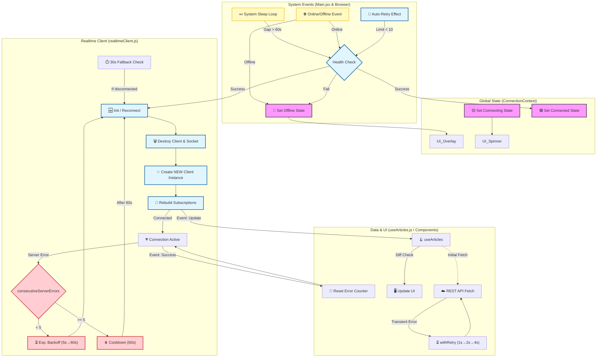

# Hálózati és Kapcsolatkezelési Architektúra

Ez a diagram bemutatja a Maestro plugin kapcsolatkezelési logikáját, beleértve az alvásból való visszatérést (Sleep Recovery), az automatikus újrapróbálkozást (Auto-Retry) és a valós idejű adatfrissítéseket.

## Folyamatok magyarázata

### 1. Események (System Events)
- **Sleep Detector**: Az InDesign `IdleTask` segítségével figyeli a rendszer alvását. Ha 60 másodpercnél nagyobb kimaradást észlel, ellenőrzi a kapcsolatot: ha élő, csak frissít, ha megszakadt, reconnectel.
- **Network Events**: A böngésző szabványos `online`/`offline` eseményeit figyeli.
- **Auto-Retry**: Hiba esetén 10 alkalommal próbálkozik az újracsatlakozással, exponenciális vagy konstans várakozással.

### 2. Kapcsolatkezelő (ConnectionContext)
- Ez a réteg felelős az UI tájékoztatásáért (Spinner, Overlay megjelenítése).
- Dönt a "Health Check" (egyszerű HTTP kérés) eredménye alapján.

### 3. Realtime Client (A motor)
- **Destroy & Rebuild stratégia**: Alvás vagy hiba után nem próbálja javítani a kapcsolatot, hanem **eldobja a teljes Appwrite Client példányt** és újat hoz létre. Ez garantálja, hogy nem maradnak "zombi" WebSocket kapcsolatok.
- **Szinkron Resubscribe**: Az új kapcsolat felépülése után **szinkron** újra feliratkozik a szükséges csatornákra. A feliratkozások NEM `setTimeout`-ban futnak — a szinkron végrehajtás megakadályozza, hogy az `isConnected` flag ideiglenesen `false` maradjon (ami végtelen recovery ciklust okozna).
- **WebSocket Auth**: A proxy `onProxyReqWs` hookja injektálja a cookie-kat a WS upgrade kérésbe. A kliens oldalon `readyState` guard + 200ms retry védi a UXP timing problémáktól.

### 4. Server Error Resilience (Realtime)
- **Exponenciális backoff**: Szerver hiba (pl. code 1003) után növekvő várakozás: 5s → 10s → 20s → 40s → max 60s.
- **Cooldown**: 5 egymás utáni szerver hiba után 60 másodperces szünet — `_notifyError()` jelzi a hibát.
- **Reset**: Sikeres `event` üzenet vagy `reconnect()` hívás nullázza a számlálót.

### 5. API Resilience (Adatbázis hívások)
- **Centralizált Retry**: A `withRetry` segédfüggvény védi az összes adatbázis műveletet a váratlan szerverleállások (pl. 502 Bad Gateway) ellen.
- **Backoff**: 1s → 2s → 4s (max 3 próbálkozás).
- Ez garantálja, hogy egy rövid szerver hiba ne okozzon azonnali adatvesztést vagy hibaüzenetet a felhasználónak.
- **Timeout ≠ Offline**: Az adatlekérés időtúllépése (pl. lassú szerver válasz) NEM aktiválja az offline overlay-t. Ehelyett toast figyelmeztetést kap a felhasználó ("Lassú kapcsolat"). Csak a valódi hálózati hibák (Failed to fetch, ECONNREFUSED stb.) váltják ki az offline állapotot.

### 6. RecoveryManager védelmek
- **Debounce (végponttól számítva)**: A `lastRecoveryAt` a recovery VÉGÉN is frissül (nem csak az elején), megakadályozva, hogy egy hosszú recovery (pl. health check retry-okkal) lejárja a debounce-t és a következő focus event azonnal újat indítson.
- **isReconnecting guard**: A RecoveryManager ellenőrzi `realtime.isReconnecting` flag-et, és nem indít újabb `reconnect()`-et, ha egy már folyamatban van.
- **Fetch generáció-számláló**: A `fetchGenerationRef` védi a `fetchData`-t a dupla hívás ellen. Ha a recovery + publication switch egyidejűleg indít fetch-et, az elavult eredmény eldobódik (a frissebb hívás generációja érvényes marad). Ez kiegészíti a RecoveryManager debounce-t: a debounce a recovery szinten, a generáció-számláló a fetchData szinten véd.
- **Overlay cleanup (finally)**: A `DataContext.fetchData` finally blokkja mindig törli az `isConnecting` állapotot, ha nem mentünk offline-ba — megakadályozza az overlay beragadását timeout, auth vagy egyéb hiba esetén. Csak a legfrissebb generáció állítja a loading state-et.

### 7. Adat & UI
- A `useArticles` hook kapja az értesítéseket.
- Beépített "Diff Check" gondoskodik róla, hogy csak valódi adatváltozás esetén frissüljön az UI (React render), elkerülve a villogást.
