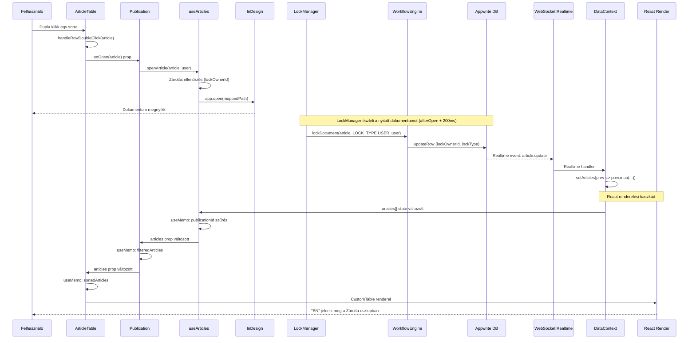

# Fájl megnyitás adatfolyam

Ez a diagram bemutatja, mi történik lépésről lépésre, amikor a felhasználó megnyit egy InDesign fájlt a Maestro pluginban — az egérkattintástól a UI frissüléséig.

## Teljes folyamat



## Lépések részletesen

### 1. Felhasználói akció → InDesign megnyitás

```text
ArticleTable handleRowDoubleClick(article)    ← ArticleTable.jsx:222-229
  │
  │  onOpen(article) prop hívás
  ▼
Publication handleOpenArticle(article)        ← Publication.jsx:154-167
  │
  │  openArticle(article, user)
  ▼
useArticles.openArticle()                     ← useArticles.js:242-280
  │
  ├─ Zárolás ellenőrzés: article.lockOwnerId !== user.$id → hiba
  │
  └─ app.open(mappedPath)                     ← InDesign UXP API
       │
       └─ Fallback: ExtendScript generateOpenDocumentScript()
```

### 2. LockManager zárolás → Appwrite DB

```text
LockManager handleAfterOpen (afterOpen event + 200ms delay)
  │
  └─ lockFile(filePath)                              ← LockManager.jsx
       │
       ├─ Cikk keresése az adatbázisban (filePath alapján)
       ├─ Zárolás ellenőrzés (más user lock-ja)
       │
       └─ WorkflowEngine.lockDocument(article, LOCK_TYPE.USER, user)
            │
            └─ tables.updateRow(lockOwnerId, lockType)  ← sima DB update
```

> A valódi fájlszintű zárolást az InDesign `.idlk` mechanizmusa végzi —
> a DB lock informatív jellegű (a UI-ban mutatja, ki szerkeszti éppen).

### 3. Realtime event → DataContext state frissítés

```text
Appwrite szerver
  │
  └─ WebSocket event: databases.*.collections.ARTICLES.documents.*.update
       │
       └─ DataContext realtime handler (DataContext.jsx:177-241)
            │
            └─ setArticles(prev => {
                 const updated = prev.map(a =>
                   a.$id === doc.$id ? doc : a   // doc = frissített article (lockOwnerId-val)
                 );
                 return nameChanged ? updated.sort(...) : updated;
               });
```

### 4. React renderelési kaszkád

```text
DataContext articles[] state változik (realtime event által)
  │
  ▼
useArticles useMemo (useArticles.js:60-63)
  │  allArticles.filter(a => a.publicationId === publicationId)
  │  → Eredmény: a kiadvány szűrt cikkei (lockOwnerId már benne van)
  │
  ▼
Publication filteredArticles useMemo (Publication.jsx:124-142)
  │  articles.filter(statusMatch && markerMatch)
  │  → Eredmény: szűrt + szűrt cikkek
  │
  ▼
ArticleTable sortedArticles useMemo (ArticleTable.jsx:150-198)
  │  [...articles].sort(sortColumn, sortDirection)
  │  → Eredmény: szűrt + szűrt + rendezett cikkek
  │
  ▼
CustomTable renderel
  │  A "Zárolta" oszlop renderCell-je (ArticleTable.jsx:106-113):
  │    getLockLabel(article)
  │      → lockOwnerId === currentUser.$id → "Én"
  │      → lockType === "system" → "Maestro"
  │      → egyéb → felhasználó neve
  │
  ▼
Felhasználó látja: "ÉN" a Zárolta oszlopban
```

## Időbeli sorrend

| Lépés   | Időpont (kb.) | Mi történik                                              |
| ------- | ------------- | -------------------------------------------------------- |
| T+0ms   | Dupla klikk   | `handleRowDoubleClick`                                   |
| T+1ms   |               | `openArticle()` → zárolás ellenőrzés                     |
| T+50ms  |               | `app.open(path)` → InDesign megnyitja a fájlt            |
| T+250ms |               | LockManager `handleAfterOpen` (afterOpen + 200ms delay)  |
| T+350ms |               | `lockFile()` → DB query (cikk keresése filePath alapján) |
| T+450ms |               | `WorkflowEngine.lockDocument()` → `updateRow()`          |
| T+550ms |               | Appwrite Realtime event → DataContext `setArticles()`    |
| T+555ms |               | `useArticles` useMemo újraszámol                         |
| T+560ms |               | `Publication` filteredArticles újraszámol                |
| T+565ms |               | `ArticleTable` sortedArticles újraszámol                 |
| T+570ms |               | CustomTable renderel → "ÉN" megjelenik                   |

## Megjegyzés

Ez a folyamat **teljesen automatikus** — nincs manuális refresh és nincs custom event dispatch.
Az egész a React normál renderelési mechanizmusán megy keresztül:
DB update → Appwrite Realtime event → DataContext state változik → useMemo-k kaszkádban újraszámolnak → UI frissül.

Ez ugyanaz az egységes adatfolyam, amit az állapotváltás (`executeTransition`) és a marker toggle
(`toggleMarker`) is követ — sima `updateRow` → realtime → UI (lásd: `data-flow-architecture.md`).
